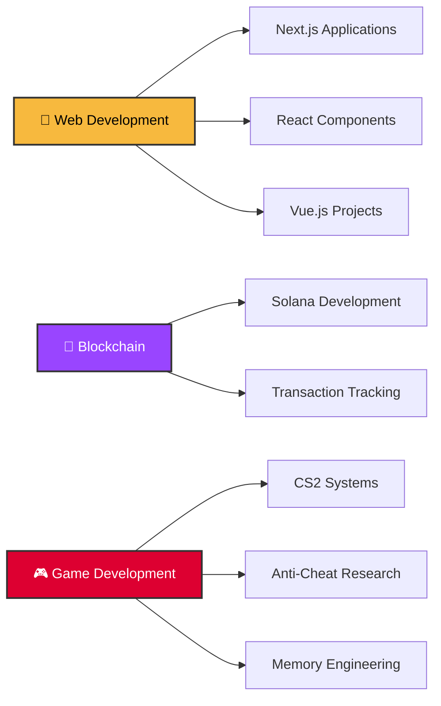

<div align="center">


<p align="center">
  
</p>

<div align="center">


</div>
</div>

---

<div align="center">

### 🚀 About Me

```typescript
const kayf = {
    location: "Berlin, Germany 🇩🇪",
    timezone: "UTC +01:00",
    role: "Full-Stack Developer & Game Systems Engineer",
    code: ["JavaScript", "TypeScript", "C++", "Rust", "PHP", "Python"],
    askMeAbout: ["web dev", "blockchain", "game dev", "security research"],
    technologies: {
        frontEnd: {
            frameworks: ["Next.js", "React", "Vue.js", "Angular"],
            styling: ["TailwindCSS", "SCSS", "Styled Components"],
            uiLibs: ["shadcn/ui", "Aceternity UI", "Radix UI"]
        },
        backEnd: {
            frameworks: ["Node.js", "Express", "NestJS"],
            databases: ["PostgreSQL", "MongoDB", "Supabase", "Redis"],
            other: ["REST APIs", "GraphQL", "WebSockets"]
        },
        blockchain: {
            platforms: ["Solana"],
            tools: ["Web3.js", "Transaction Analysis", "Token Tracking"]
        },
        gameDev: {
            languages: ["C++", "Rust"],
            focus: ["Anti-Cheat Systems", "Game Security", "CS2 Development"],
            tools: ["ImGui", "DirectX", "Memory Engineering"]
        },
        devOps: ["Docker", "Git", "GitHub Actions", "Vercel"],
        tools: ["VSCode", "WebStorm", "Visual Studio", "Cursor"]
```

</div>

---

## 💼 Tech Stack

### 🌐 Frontend Development


### Backend & Database


### Blockchain & Web3


### Game Development


### Tools & DevOps


</div>

---

## 🎯 Current Focus




</div>

---

## 📈 Contribution Graph

<div align="center">

[](https://github.com/ashutosh00710/github-readme-activity-graph)

</div>

---

## 🎵 Beyond Code

<div align="center">

### Music Production with Live Coding

Creating electronic music using **Strudel** - a live coding environment for algorithmic music composition

**Genres:** Drum & Bass • House • Acid Techno • Breakcore

</div>

---

## 🤝 Connect With Me

<div align="center">

[](https://github.com/vKAYFv)
[](https://discord.com)
[](https://t.me)

</div>

---

<div align="center">

### 💭 Quote of the Day


---

### 🐍 Contribution Snake


---


**✨ Made with 💛 by KAYF DevStudio**

</div>
